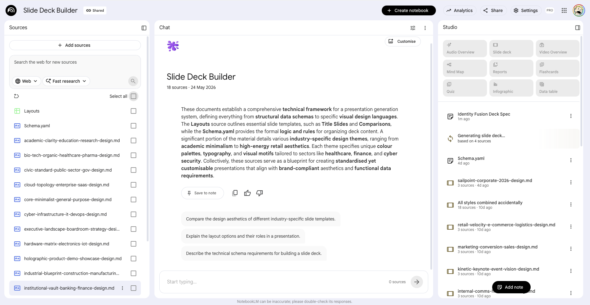
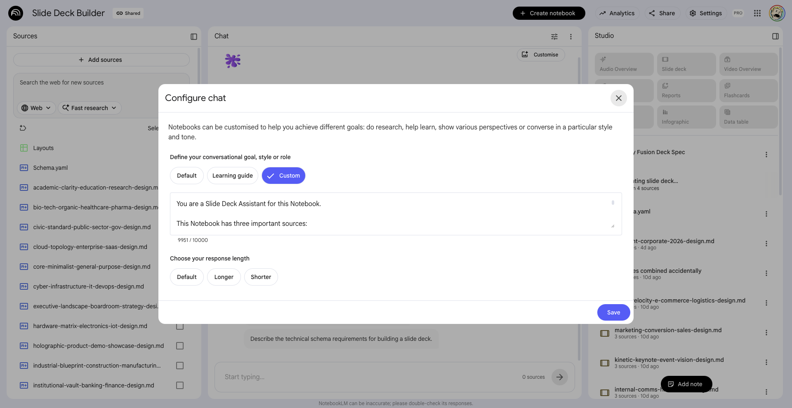
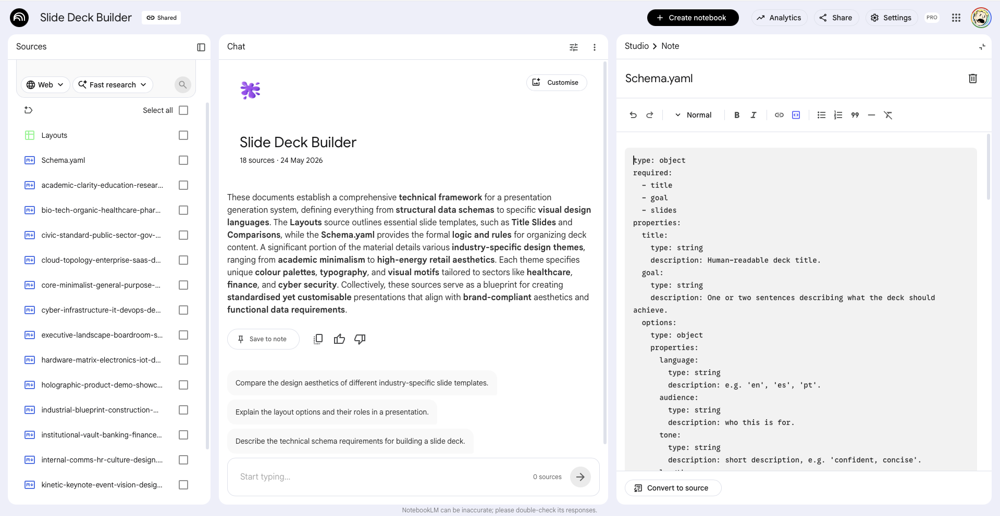
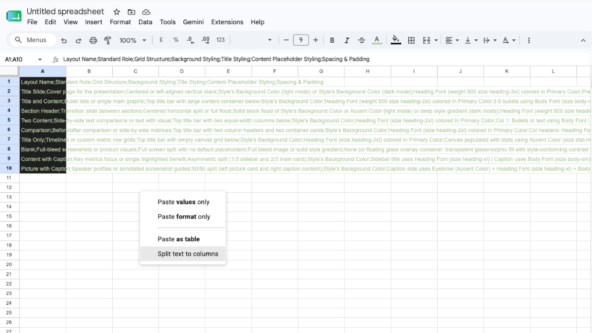
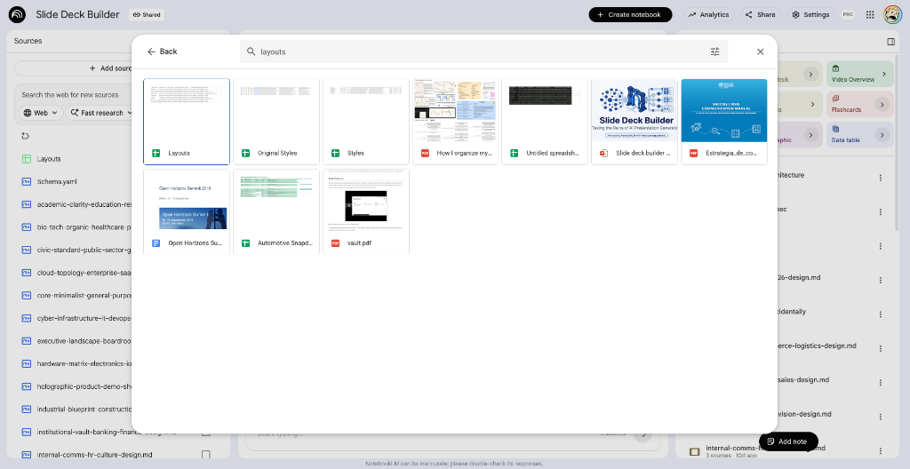
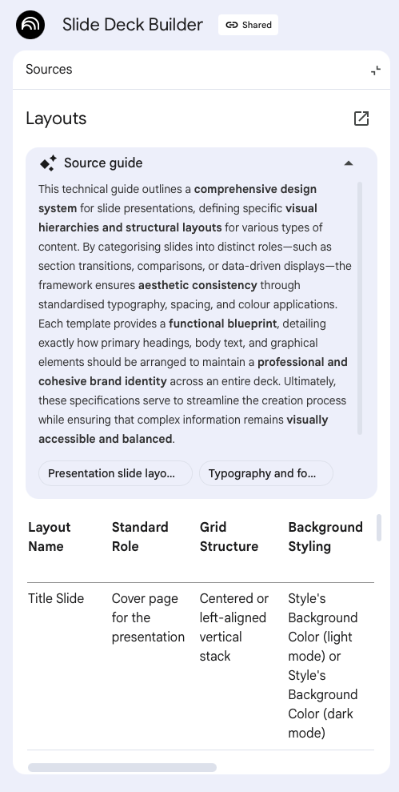
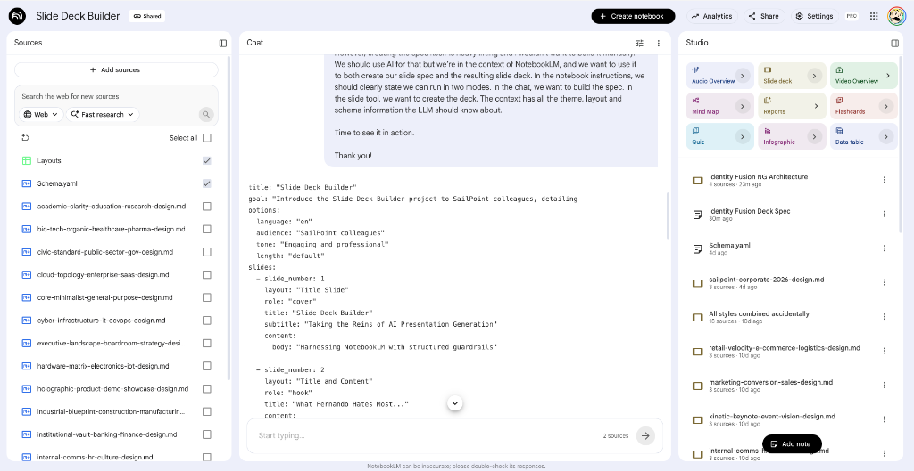
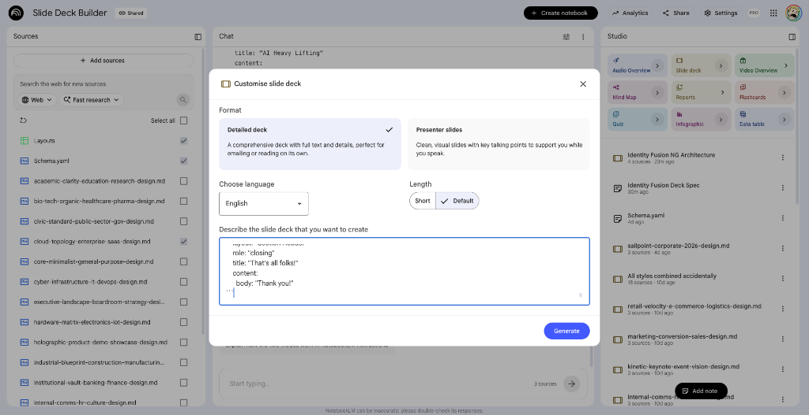

# Slide Deck Builder

This project utilizes NotebookLM as an automated slide deck builder. By providing structured schemas and design assets, we can generate presentations with accurate and foreseeable results.

## Overview

NotebookLM serves two primary purposes in this workflow:
1. **Creating the Deck Spec**: Generating a structured YAML specification for the presentation based on source material.
2. **Creating the Slide Deck**: Compiling the generated specification into a fully formatted slide deck.

The declarative nature of the specification ensures that the final presentation adheres strictly to predefined design rules, resulting in a consistent and high-quality output.

## Core Components

The deck generation process relies on three foundational files:

### 1. Schema (`Schema.yaml`)
This is the blueprint for the presentation. It defines the required structure for the deck, including:
- **Global Properties**: `title`, `goal`, and `options` (language, audience, tone, length).
- **Slides Array**: A list of individual slides, each requiring a specific `layout`, semantic `role`, `title`, and `content` (body text, bullets, media regions), along with optional presenter `notes`.

### 2. Layouts (`Layouts.csv`)
This file defines the available per-slide structural layouts. When NotebookLM generates a slide in the spec, it must choose a layout defined here. 
Layouts dictate the grid structure, placeholder styling, background behavior, and spacing.
*Examples include:* Title Slide, Title and Content, Two Content, Comparison, and Picture with Caption.

### 3. Design System (`designs/` directory)
This directory contains individual markdown files (`*-design.md`) defining the available visual themes with high precision.
Each design file includes a YAML frontmatter detailing the precise color palette, comprehensive typographic scale (sizes, weights, and letter spacings), granular spacing and border-radius rules, and specific component bindings. The body of the file explains the illustration motif and the overall design rationale.
*Examples include:* `sailpoint-corporate-2026-design.md`, `cloud-topology-enterprise-saas-design.md`, `core-minimalist-general-purpose-design.md`.

## NoteBookLM Configuration

The project contains all the necessary artefacts to build it. To configure NoteBookLM for slide deck generation, follow these steps:

1. **Add Styles**: Add all the styles you'd like to use to sources. You must select just one when generating a slide.
   

2. **System Prompt**: Add `System prompt.txt` to the chat configuration.
   

3. **Schema Note**: Set a new "Schema.yaml" note with `Schema.yaml` contents in a code block and promote it to a source.
   

4. **Layouts Source**: Create a "Layouts" Google sheet with `Layouts.csv` contents and add it to sources.
   
   
   

## Workflow

1. **Input**: Provide NotebookLM with your source documents (e.g., research notes, articles, or outlines) along with the Schema, Layouts, and the Design System definitions.
2. **Spec Generation**: Ask NotebookLM to generate a slide deck specification. It will produce a YAML file adhering to `Schema.yaml`, utilizing appropriate layouts from `Layouts.csv` for each slide.
   > **Note**: When creating the spec, make sure your knowledge sources, Layouts, and Schema.yaml are enabled. Disable the styles sources for this step.
   > 
   > 
3. **Slide Deck Generation**: Once you've got the slide spec deck file ready, copy and paste it into the Slide deck tool configuration. Make sure Layouts, Schema.yaml and the ONLY ONE style you want to use are selected sources. Add other knowledge sources you may need.
   > 
   > 
4. **Compilation**: The resulting YAML spec is parsed and compiled into the final presentation. During compilation, the selected Design System rules (colors, typography scales, components) are applied to guarantee a predictable and professionally designed slide deck.
